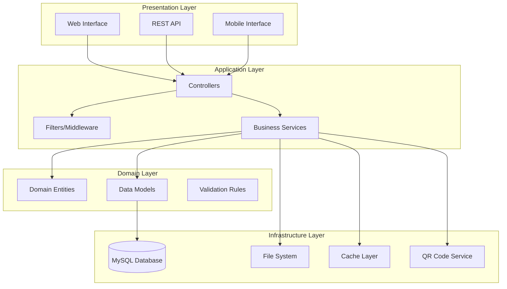
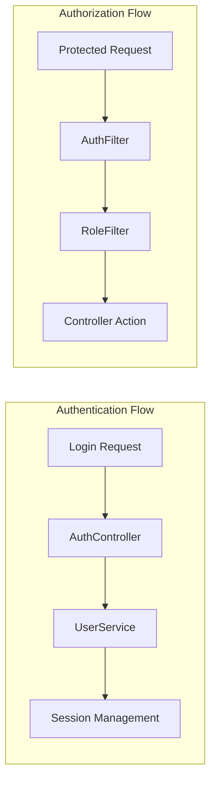
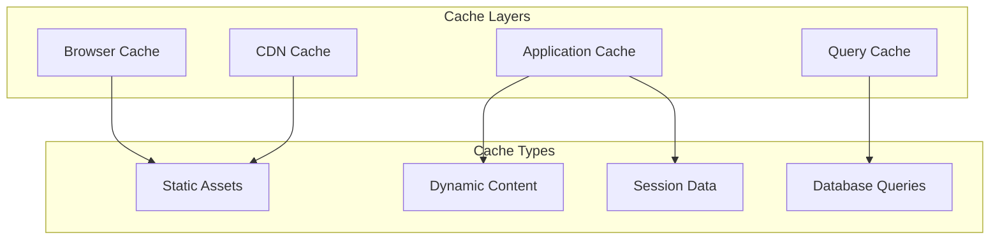
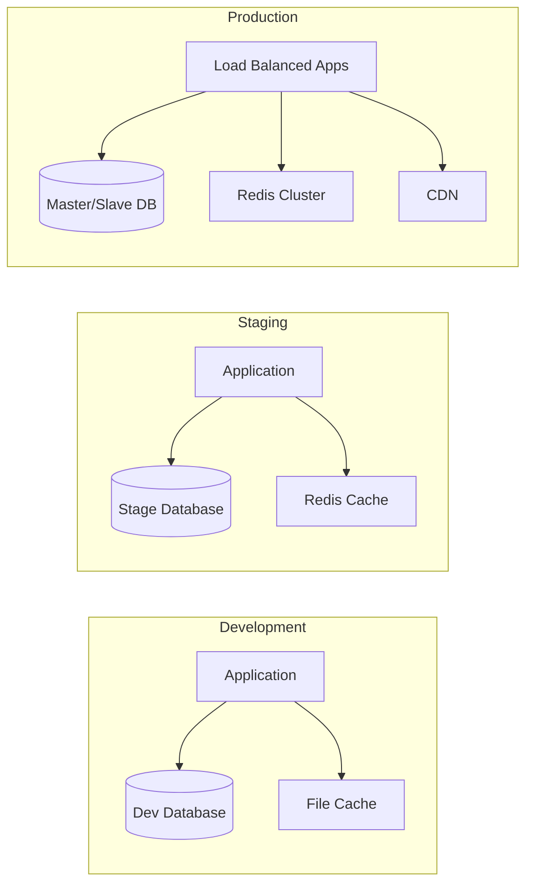
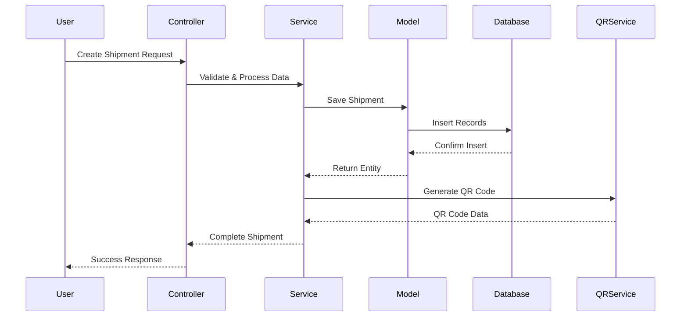
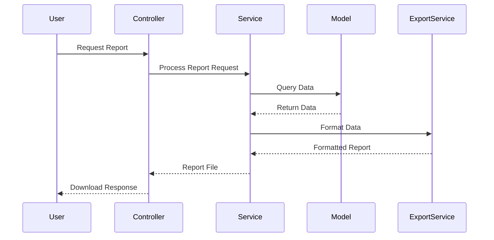

# System Architecture Documentation

## Overview

The CodeIgniter Logistics Modernization System is a comprehensive shipping management application that has been upgraded from CodeIgniter 2.2.0 to CodeIgniter 4.x with PHP 8.0.6 compatibility. The system manages logistics operations including inventory management, customer relations, courier management, shipping transactions, and comprehensive reporting.

## System Architecture

### High-Level Architecture



### Framework Architecture (CodeIgniter 4.x)

The application follows CodeIgniter 4.x architectural patterns:

#### MVC Pattern Enhancement
- **Controllers**: Handle HTTP requests and coordinate between services
- **Models**: Manage data persistence and database operations
- **Views**: Render user interface components
- **Entities**: Represent domain objects with business logic
- **Services**: Contain business logic and coordinate between models

#### Key Architectural Components

1. **Namespace Structure**
   ```
   App\
   ├── Controllers\        # HTTP request handlers
   ├── Models\            # Data access layer
   ├── Entities\          # Domain objects
   ├── Services\          # Business logic layer
   ├── Filters\           # Request/response middleware
   ├── Validation\        # Input validation rules
   ├── Views\             # Presentation templates
   ├── Config\            # Application configuration
   └── Database\          # Migrations and seeds
   ```

2. **Dependency Injection Container**
   - Services are registered in the container for better testability
   - Automatic dependency resolution for controllers and services

3. **Request/Response Cycle**
   ```mermaid
   sequenceDiagram
       participant Client
       participant Router
       participant Filter
       participant Controller
       participant Service
       participant Model
       participant Database
       
       Client->>Router: HTTP Request
       Router->>Filter: Route to Filter
       Filter->>Controller: Authorized Request
       Controller->>Service: Business Logic Call
       Service->>Model: Data Operation
       Model->>Database: SQL Query
       Database-->>Model: Result Set
       Model-->>Service: Entity Objects
       Service-->>Controller: Processed Data
       Controller-->>Client: HTTP Response
   ```

## Design Patterns

### 1. Repository Pattern
Models act as repositories for data access, abstracting database operations:

```php
class PengirimanModel extends Model
{
    public function getWithDetails(string $id): ?PengirimanEntity
    public function getShipmentsByDateRange(string $from, string $to): array
    public function generateNextId(): string
}
```

### 2. Service Layer Pattern
Business logic is encapsulated in service classes:

```php
class PengirimanService
{
    public function createShipment(array $data): PengirimanEntity
    public function updateShipmentStatus(string $id, int $status): bool
    public function generateDeliveryNote(string $id): string
}
```

### 3. Entity Pattern
Domain objects with behavior and validation:

```php
class PengirimanEntity extends Entity
{
    public function getStatusText(): string
    public function isDelivered(): bool
    public function canBeModified(): bool
}
```

### 4. Filter Pattern
Cross-cutting concerns handled by filters:

```php
class AuthFilter implements FilterInterface
class RoleFilter implements FilterInterface
class SecurityFilter implements FilterInterface
```

## Security Architecture

### Authentication & Authorization



### Security Layers

1. **Input Validation**
   - Server-side validation using CodeIgniter validation rules
   - Custom validation rules for business logic
   - XSS prevention through output escaping

2. **Authentication Security**
   - Password hashing using PHP 8.0 password_hash()
   - Secure session management
   - CSRF protection on all forms

3. **Authorization Control**
   - Three-tier user system (Admin, Finance, Gudang)
   - Role-based access control filters
   - Method-level permission checks

4. **Database Security**
   - Prepared statements for all queries
   - SQL injection prevention
   - Database connection security

## Performance Architecture

### Caching Strategy



### Performance Optimizations

1. **Database Optimization**
   - Proper indexing on frequently queried columns
   - Query optimization and caching
   - Connection pooling

2. **Asset Optimization**
   - CSS/JS minification and compression
   - Image optimization (WebP with fallbacks)
   - Lazy loading for non-critical resources

3. **Application Caching**
   - Frequently accessed data caching
   - Session optimization
   - Template caching

## Technology Stack

### Backend Technologies
- **Framework**: CodeIgniter 4.x
- **Language**: PHP 8.0.6
- **Database**: MySQL 5.7+
- **Web Server**: Apache/Nginx
- **Caching**: File-based caching (configurable for Redis/Memcached)

### Frontend Technologies
- **CSS Framework**: Bootstrap 5.x
- **JavaScript**: Vanilla ES6+ with progressive enhancement
- **Icons**: Font Awesome 6.x
- **Charts**: Chart.js for analytics
- **Tables**: Enhanced DataTables for data management

### Development Tools
- **Testing**: PHPUnit for unit and integration testing
- **Code Quality**: PHP_CodeSniffer for coding standards
- **Documentation**: PHPDoc for inline documentation
- **Version Control**: Git with conventional commits

## Deployment Architecture

### Environment Configuration



### Scalability Considerations

1. **Horizontal Scaling**
   - Stateless application design
   - Session storage in external cache
   - Database read replicas

2. **Vertical Scaling**
   - Optimized database queries
   - Efficient memory usage
   - CPU-intensive task optimization

3. **Monitoring & Logging**
   - Application performance monitoring
   - Error tracking and alerting
   - Security event logging

## Integration Points

### External Services
- **QR Code Generation**: Internal service using PHP QR libraries
- **PDF Generation**: TCPDF for delivery note generation
- **File Upload**: Secure file handling with validation
- **Email Notifications**: CodeIgniter email library (configurable)

### API Endpoints
The system provides RESTful API endpoints for:
- Authentication and user management
- Shipment tracking and status updates
- QR code generation and validation
- Report generation and data export

## Data Flow Architecture

### Shipment Creation Flow



### Report Generation Flow



## Maintenance & Monitoring

### Health Checks
- Database connectivity monitoring
- File system permissions verification
- Cache system status checks
- External service availability

### Logging Strategy
- Application logs for business operations
- Security logs for authentication events
- Error logs for system failures
- Performance logs for optimization

### Backup Strategy
- Daily database backups
- File system backups for uploads
- Configuration backups
- Disaster recovery procedures

This architecture provides a solid foundation for the modernized logistics system, ensuring scalability, maintainability, and security while preserving all existing functionality.