# Business Processes and Workflows

## Overview

This document outlines the business processes and workflows implemented in the CodeIgniter Logistics System. It provides detailed descriptions of how business operations flow through the system, from initial setup through daily operations and reporting.

## Core Business Processes

### 1. System Initialization Process

#### Initial System Setup
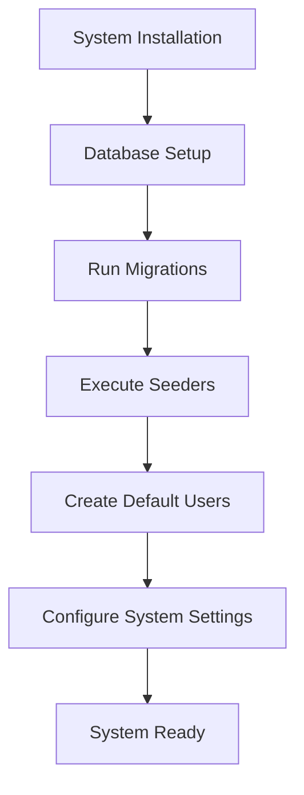

**Process Steps:**
1. **Database Creation**: Create MySQL database with proper character set
2. **Migration Execution**: Run all database migrations to create tables
3. **Data Seeding**: Populate initial data including default users
4. **User Account Setup**: Create three default user accounts with proper credentials
5. **System Configuration**: Configure application settings and security parameters

**Stakeholders:**
- System Administrator
- IT Support Team
- Database Administrator

**Success Criteria:**
- All database tables created successfully
- Default users can log in with specified credentials
- System passes health checks

### 2. User Management Workflow

#### User Creation Process
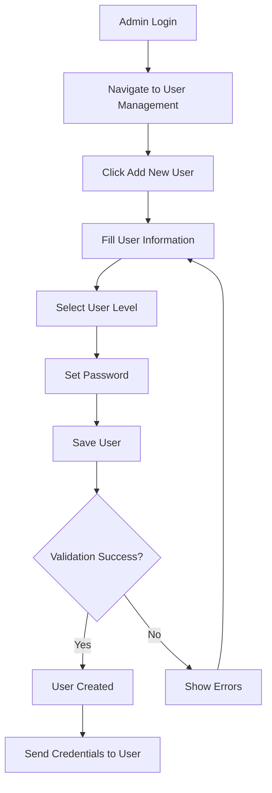

**Process Details:**
- **Input Requirements**: Username, password, user level (1-3)
- **Validation Rules**: Unique username, strong password, valid user level
- **Security Measures**: Password hashing, input sanitization
- **Notifications**: User credentials communicated securely

**User Levels and Permissions:**
- **Level 1 (Admin)**: Full system access, user management, configuration
- **Level 2 (Finance)**: Financial reports, customer management, read-only inventory
- **Level 3 (Gudang)**: Inventory management, shipment operations, item categories

### 3. Inventory Management Process

#### Category Management Workflow
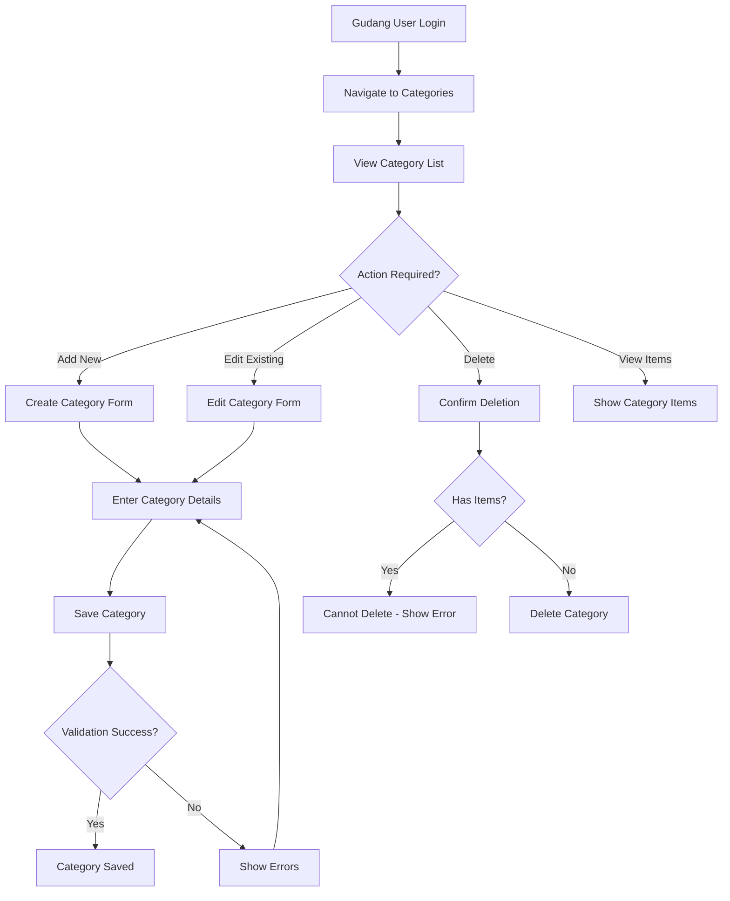

#### Item Management Workflow
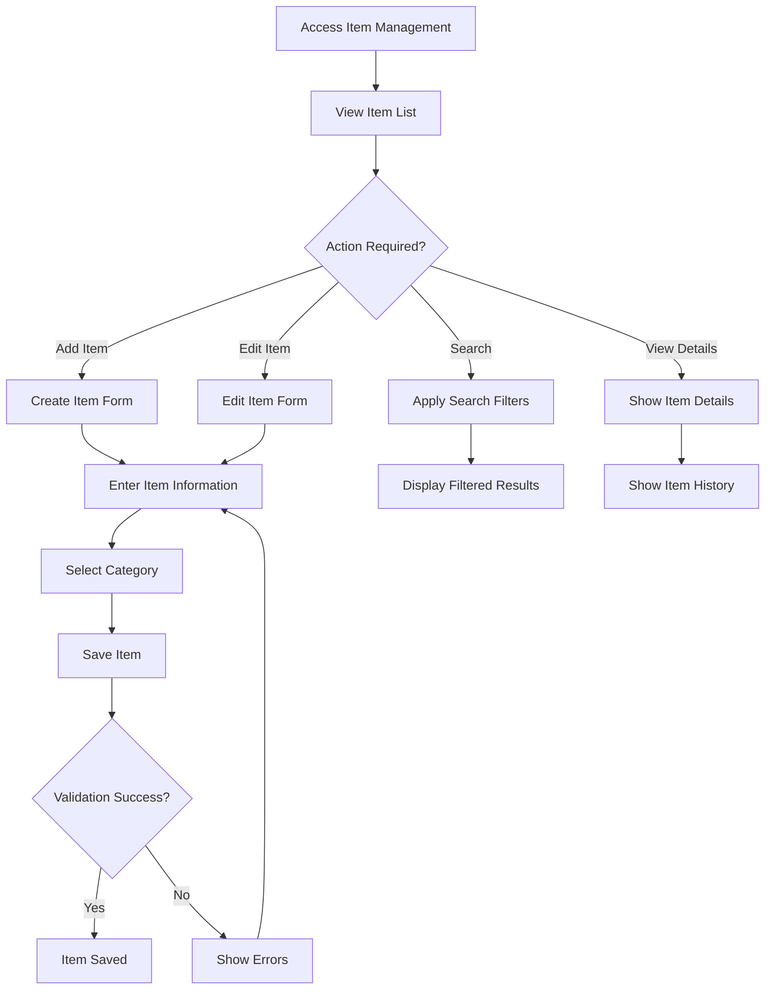

**Business Rules:**
- Items must belong to a valid category
- Item IDs are auto-generated in BRG format
- Categories cannot be deleted if they contain items
- Item names must be unique within categories

### 4. Customer Management Process

#### Customer Registration Workflow
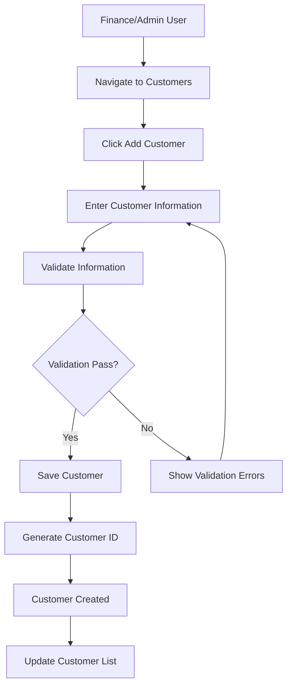

**Required Information:**
- Company name (up to 30 characters)
- Contact phone number (Indonesian format)
- Complete business address
- Billing information (for finance users)

**Validation Rules:**
- Unique customer names within the system
- Valid phone number format
- Complete address information required
- Customer ID auto-generated in CST format

### 5. Courier Management Process

#### Courier Registration and Management
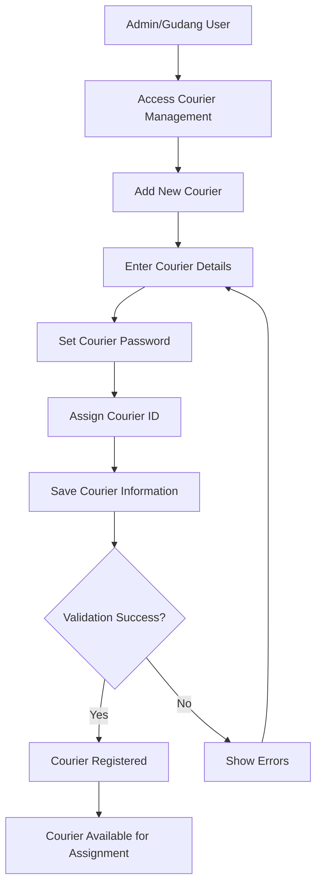

**Courier Information:**
- Personal details (name, gender, contact)
- Address and location information
- Login credentials for system access
- Performance tracking metrics

### 6. Shipment Management Process

#### Shipment Creation Workflow
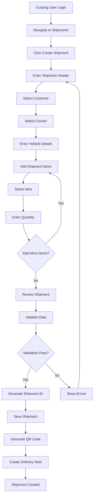

**Shipment Creation Rules:**
- Shipment ID format: KRM + YYYYMMDD + sequence number
- All items must be available in inventory
- Customer and courier must be valid and active
- Vehicle number must be provided
- Purchase order number is required

#### Shipment Status Management
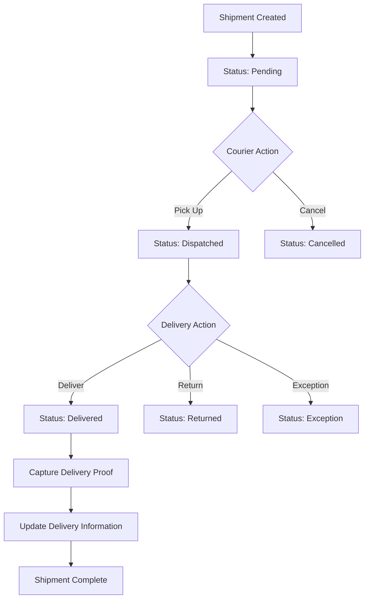

**Status Definitions:**
- **Pending (0)**: Shipment created, awaiting dispatch
- **Delivered (1)**: Successfully delivered to customer
- **Cancelled (2)**: Shipment cancelled before delivery

#### Delivery Confirmation Process
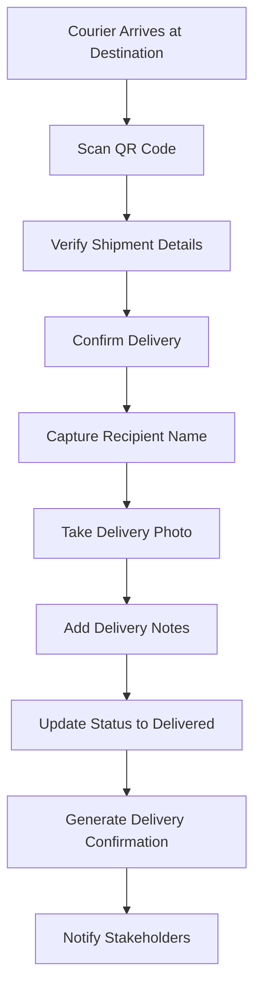

### 7. QR Code and Document Generation

#### QR Code Generation Process
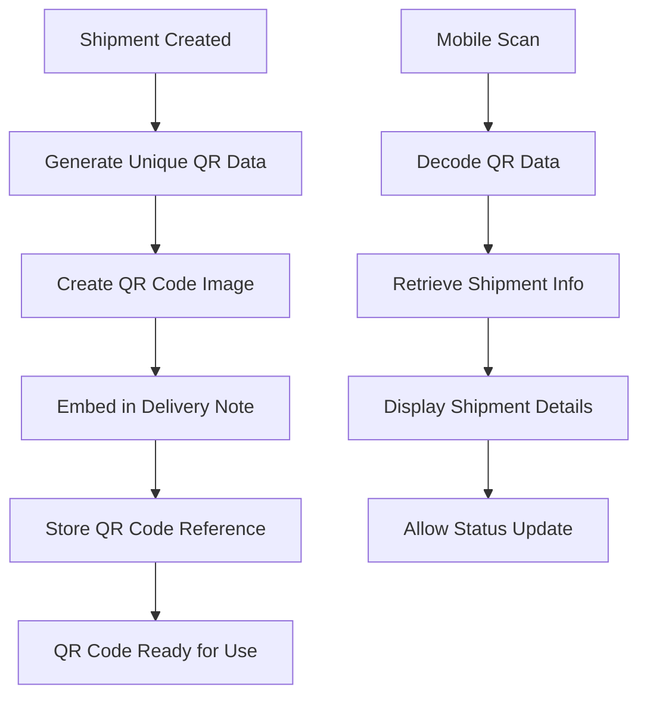

**QR Code Content:**
- Shipment ID
- Creation timestamp
- Verification hash
- Customer reference

#### Delivery Note Generation
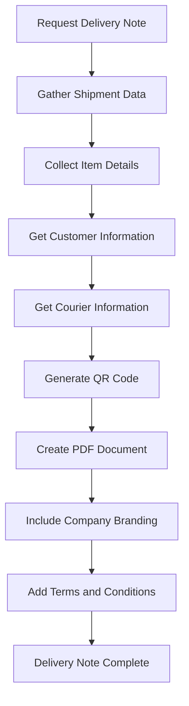

### 8. Reporting and Analytics Process

#### Report Generation Workflow
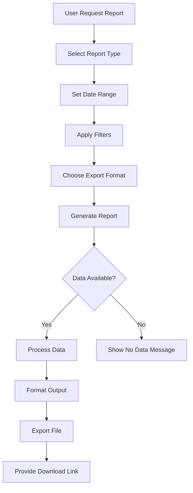

**Available Reports:**
- Daily shipment summaries
- Monthly performance reports
- Customer analysis reports
- Courier performance metrics
- Inventory movement reports
- Financial summaries (Finance users)

#### Analytics Dashboard Process
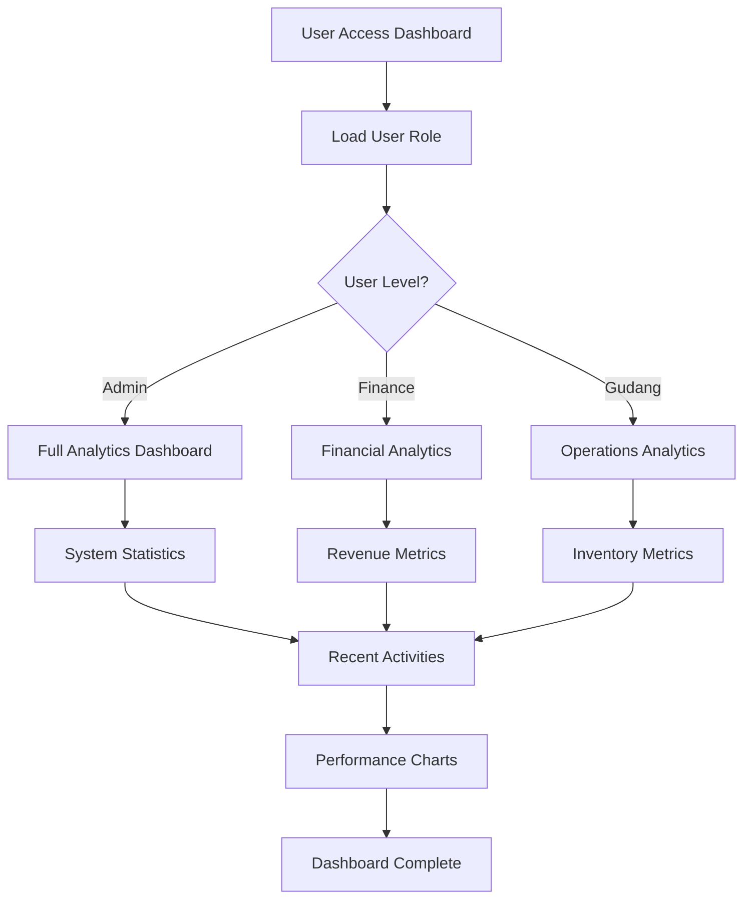

### 9. Security and Access Control Process

#### Authentication Workflow
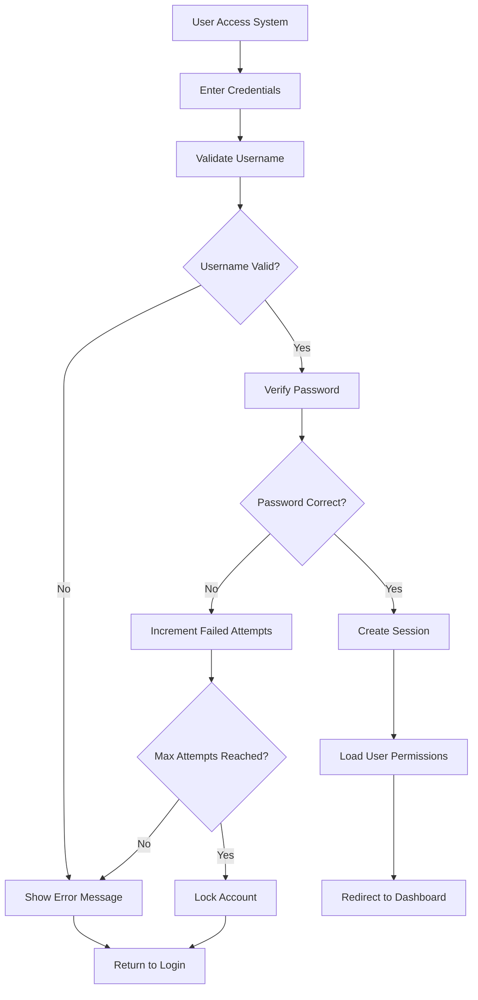

#### Authorization Process
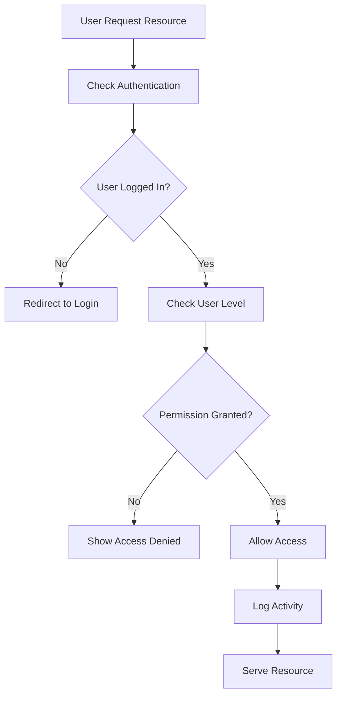

### 10. Data Migration and Integration Process

#### Legacy Data Migration
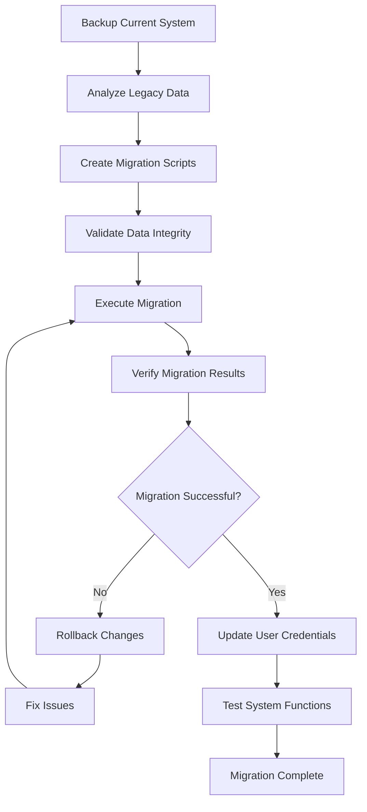

**Migration Steps:**
1. **Data Backup**: Complete backup of existing system
2. **Schema Mapping**: Map old schema to new structure
3. **Data Transformation**: Convert data to new format
4. **Validation**: Verify data integrity and completeness
5. **User Update**: Update user credentials and permissions
6. **Testing**: Comprehensive system testing

### 11. Mobile Operations Process

#### Mobile QR Scanning Workflow
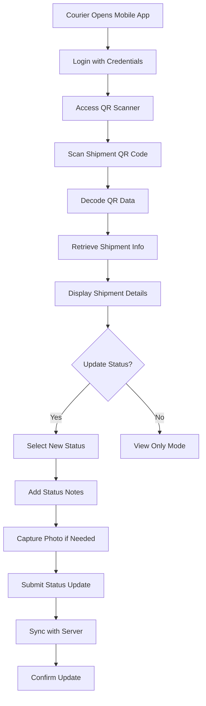

### 12. Error Handling and Recovery Process

#### System Error Management
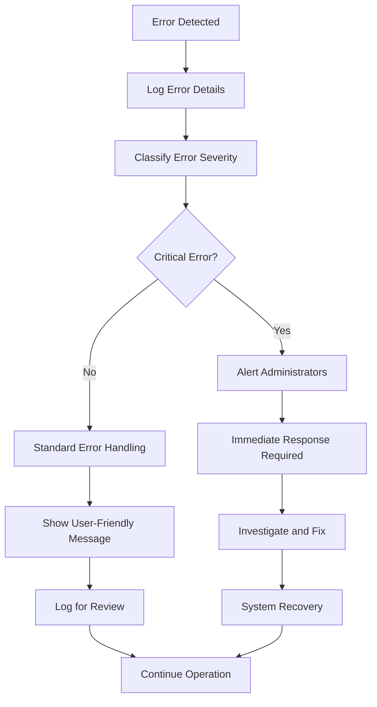

**Error Categories:**
- **Critical**: System failures, security breaches
- **High**: Data corruption, authentication failures
- **Medium**: Validation errors, performance issues
- **Low**: User input errors, minor display issues

### 13. Backup and Recovery Process

#### Automated Backup Workflow
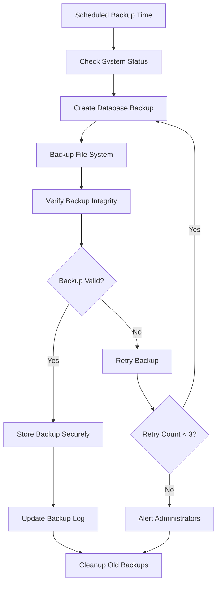

**Backup Schedule:**
- **Daily**: Incremental database backups
- **Weekly**: Full system backups
- **Monthly**: Archive backups for long-term storage

### 14. Performance Monitoring Process

#### System Performance Monitoring
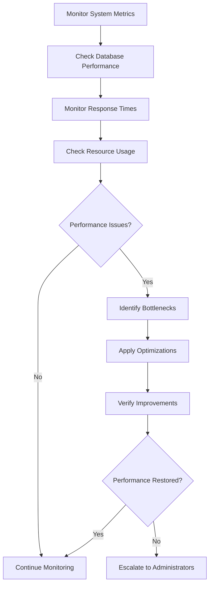

**Monitoring Metrics:**
- Database query performance
- Page load times
- Memory and CPU usage
- Disk space utilization
- Network latency

## Business Rules and Constraints

### Data Integrity Rules
1. **Referential Integrity**: All foreign key relationships must be maintained
2. **Unique Constraints**: Usernames, shipment IDs, and customer names must be unique
3. **Data Validation**: All input data must pass validation before storage
4. **Audit Trail**: All data modifications must be logged with user and timestamp

### Business Logic Constraints
1. **User Permissions**: Users can only access functions appropriate to their level
2. **Shipment Status**: Status changes must follow logical progression
3. **Inventory Management**: Items cannot be deleted if referenced in shipments
4. **Customer Management**: Customer information must be complete before creating shipments

### Security Requirements
1. **Authentication**: All users must authenticate before system access
2. **Password Policy**: Passwords must meet minimum security requirements
3. **Session Management**: Sessions must timeout after inactivity
4. **Data Protection**: Sensitive data must be encrypted and protected

This comprehensive business process documentation ensures that all stakeholders understand how the logistics system operates and how business workflows are implemented within the technical architecture.