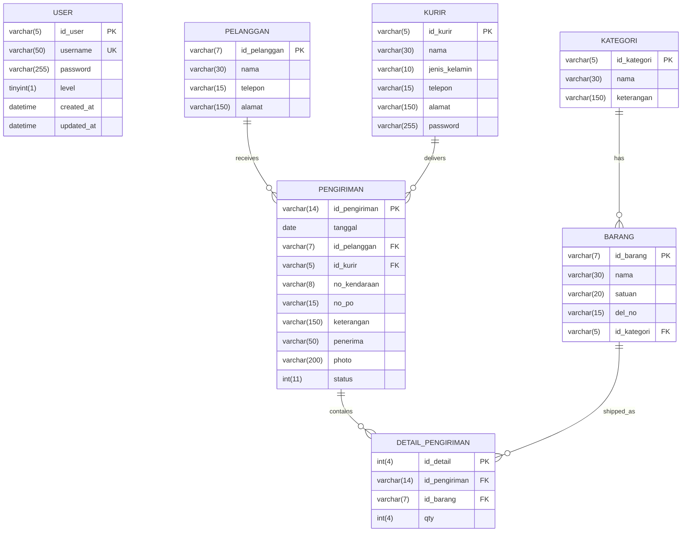

# Database Schema Documentation

## Overview

The logistics system uses a MySQL database with six main tables that manage users, categories, items, customers, couriers, shipments, and shipment details. The database has been modernized to support CodeIgniter 4.x with proper relationships and constraints.

## Entity Relationship Diagram

## Table Specifications

### 1. USER Table
Manages system users with three-tier access control.

| Column | Type | Constraints | Description |
|--------|------|-------------|-------------|
| id_user | VARCHAR(5) | PRIMARY KEY | Unique user identifier |
| username | VARCHAR(50) | UNIQUE, NOT NULL | Login username |
| password | VARCHAR(255) | NOT NULL | Hashed password (Argon2ID) |
| level | TINYINT(1) | NOT NULL | User access level (1=Admin, 2=Finance, 3=Gudang) |
| created_at | DATETIME | NULL | Record creation timestamp |
| updated_at | DATETIME | NULL | Last update timestamp |

**Indexes:**
- PRIMARY KEY (id_user)
- UNIQUE KEY (username)
- INDEX (level)

**Default Users:**
- Admin: adminpuninar (Level 1)
- Finance: financepuninar (Level 2)
- Gudang: gudangpuninar (Level 3)

### 2. KATEGORI Table
Item categories for inventory classification.

| Column | Type | Constraints | Description |
|--------|------|-------------|-------------|
| id_kategori | VARCHAR(5) | PRIMARY KEY | Category identifier |
| nama | VARCHAR(30) | NOT NULL | Category name |
| keterangan | VARCHAR(150) | NULL | Category description |

**Indexes:**
- PRIMARY KEY (id_kategori)
- INDEX (nama)

### 3. BARANG Table
Inventory items with category relationships.

| Column | Type | Constraints | Description |
|--------|------|-------------|-------------|
| id_barang | VARCHAR(7) | PRIMARY KEY | Item identifier |
| nama | VARCHAR(30) | NOT NULL | Item name |
| satuan | VARCHAR(20) | NOT NULL | Unit of measurement |
| del_no | VARCHAR(15) | NOT NULL | Delivery number |
| id_kategori | VARCHAR(5) | FOREIGN KEY | Reference to kategori table |

**Indexes:**
- PRIMARY KEY (id_barang)
- FOREIGN KEY (id_kategori) REFERENCES kategori(id_kategori)
- INDEX (nama)
- INDEX (id_kategori)

### 4. PELANGGAN Table
Customer information management.

| Column | Type | Constraints | Description |
|--------|------|-------------|-------------|
| id_pelanggan | VARCHAR(7) | PRIMARY KEY | Customer identifier |
| nama | VARCHAR(30) | NOT NULL | Customer name |
| telepon | VARCHAR(15) | NOT NULL | Phone number |
| alamat | VARCHAR(150) | NOT NULL | Customer address |

**Indexes:**
- PRIMARY KEY (id_pelanggan)
- INDEX (nama)
- INDEX (telepon)

### 5. KURIR Table
Courier information and credentials.

| Column | Type | Constraints | Description |
|--------|------|-------------|-------------|
| id_kurir | VARCHAR(5) | PRIMARY KEY | Courier identifier |
| nama | VARCHAR(30) | NOT NULL | Courier name |
| jenis_kelamin | VARCHAR(10) | NOT NULL | Gender |
| telepon | VARCHAR(15) | NOT NULL | Phone number |
| alamat | VARCHAR(150) | NULL | Address |
| password | VARCHAR(255) | NOT NULL | Hashed password for courier access |

**Indexes:**
- PRIMARY KEY (id_kurir)
- INDEX (nama)
- INDEX (telepon)

### 6. PENGIRIMAN Table
Main shipment records.

| Column | Type | Constraints | Description |
|--------|------|-------------|-------------|
| id_pengiriman | VARCHAR(14) | PRIMARY KEY | Shipment identifier (format: KRMyyyymmddnnn) |
| tanggal | DATE | NOT NULL | Shipment date |
| id_pelanggan | VARCHAR(7) | FOREIGN KEY | Reference to pelanggan table |
| id_kurir | VARCHAR(5) | FOREIGN KEY | Reference to kurir table |
| no_kendaraan | VARCHAR(8) | NOT NULL | Vehicle number |
| no_po | VARCHAR(15) | NOT NULL | Purchase order number |
| keterangan | VARCHAR(150) | NULL | Additional notes |
| penerima | VARCHAR(50) | NULL | Recipient name |
| photo | VARCHAR(200) | NULL | Delivery photo filename |
| status | INT(11) | NOT NULL | Shipment status (0=Pending, 1=Delivered, 2=Cancelled) |

**Indexes:**
- PRIMARY KEY (id_pengiriman)
- FOREIGN KEY (id_pelanggan) REFERENCES pelanggan(id_pelanggan)
- FOREIGN KEY (id_kurir) REFERENCES kurir(id_kurir)
- INDEX (tanggal)
- INDEX (status)
- INDEX (no_po)

### 7. DETAIL_PENGIRIMAN Table
Shipment item details (many-to-many relationship).

| Column | Type | Constraints | Description |
|--------|------|-------------|-------------|
| id_detail | INT(4) | PRIMARY KEY AUTO_INCREMENT | Detail record identifier |
| id_pengiriman | VARCHAR(14) | FOREIGN KEY | Reference to pengiriman table |
| id_barang | VARCHAR(7) | FOREIGN KEY | Reference to barang table |
| qty | INT(4) | NOT NULL | Quantity shipped |

**Indexes:**
- PRIMARY KEY (id_detail)
- FOREIGN KEY (id_pengiriman) REFERENCES pengiriman(id_pengiriman) ON DELETE CASCADE
- FOREIGN KEY (id_barang) REFERENCES barang(id_barang)
- INDEX (id_pengiriman)
- INDEX (id_barang)

## Database Relationships

### One-to-Many Relationships

1. **KATEGORI → BARANG**
   - One category can have multiple items
   - Foreign key: barang.id_kategori → kategori.id_kategori

2. **PELANGGAN → PENGIRIMAN**
   - One customer can have multiple shipments
   - Foreign key: pengiriman.id_pelanggan → pelanggan.id_pelanggan

3. **KURIR → PENGIRIMAN**
   - One courier can handle multiple shipments
   - Foreign key: pengiriman.id_kurir → kurir.id_kurir

4. **PENGIRIMAN → DETAIL_PENGIRIMAN**
   - One shipment can contain multiple items
   - Foreign key: detail_pengiriman.id_pengiriman → pengiriman.id_pengiriman

5. **BARANG → DETAIL_PENGIRIMAN**
   - One item can be in multiple shipment details
   - Foreign key: detail_pengiriman.id_barang → barang.id_barang

## Data Integrity Rules

### Referential Integrity
- All foreign key relationships are enforced
- Cascade delete for detail_pengiriman when pengiriman is deleted
- Restrict delete for referenced records in kategori, pelanggan, kurir, and barang

### Business Rules
1. **User Levels**: Must be 1 (Admin), 2 (Finance), or 3 (Gudang)
2. **Shipment ID Format**: KRMyyyymmddnnn (KRM + date + sequence)
3. **Status Values**: 0 (Pending), 1 (Delivered), 2 (Cancelled)
4. **Quantity**: Must be positive integer
5. **Dates**: Shipment date cannot be in the future

### Validation Rules
- Username must be unique across all users
- Phone numbers must follow Indonesian format
- Email addresses must be valid format (if added)
- Passwords must meet security requirements

## Migration Scripts

### CodeIgniter 4.x Migrations

The system includes migration files to create and update the database schema:

1. **001_create_user_table.php** - Creates modernized user table
2. **002_create_kategori_table.php** - Creates category table
3. **003_create_barang_table.php** - Creates items table with foreign keys
4. **004_create_kurir_table.php** - Creates courier table
5. **005_create_pelanggan_table.php** - Creates customer table
6. **006_create_pengiriman_table.php** - Creates shipment table
7. **007_create_detail_pengiriman_table.php** - Creates shipment details table
8. **008_add_security_indexes.php** - Adds performance and security indexes
9. **009_migrate_existing_data.php** - Migrates data from legacy system

### Database Seeding

Seeder classes populate initial data:

- **UserSeeder**: Creates default admin, finance, and gudang users
- **KategoriSeeder**: Creates initial item categories
- **TestDataSeeder**: Creates sample data for development/testing

## Performance Considerations

### Indexing Strategy

1. **Primary Keys**: All tables have efficient primary keys
2. **Foreign Keys**: Indexed for join performance
3. **Search Fields**: Names and phone numbers are indexed
4. **Date Fields**: Shipment dates indexed for reporting
5. **Status Fields**: Status values indexed for filtering

### Query Optimization

1. **Prepared Statements**: All queries use parameter binding
2. **Selective Queries**: Only fetch required columns
3. **Pagination**: Large result sets are paginated
4. **Caching**: Frequently accessed data is cached

### Storage Optimization

1. **Data Types**: Appropriate data types for storage efficiency
2. **Normalization**: Proper normalization to reduce redundancy
3. **Archiving**: Strategy for archiving old shipment data
4. **Backup**: Regular backup procedures for data protection

## Security Measures

### Data Protection

1. **Password Hashing**: All passwords use Argon2ID hashing
2. **SQL Injection Prevention**: Prepared statements for all queries
3. **Access Control**: Role-based access to sensitive data
4. **Audit Trail**: Logging of data modifications

### Backup and Recovery

1. **Daily Backups**: Automated daily database backups
2. **Point-in-Time Recovery**: Transaction log backups
3. **Disaster Recovery**: Off-site backup storage
4. **Testing**: Regular backup restoration testing

This database schema provides a robust foundation for the logistics system while maintaining data integrity and supporting efficient operations.